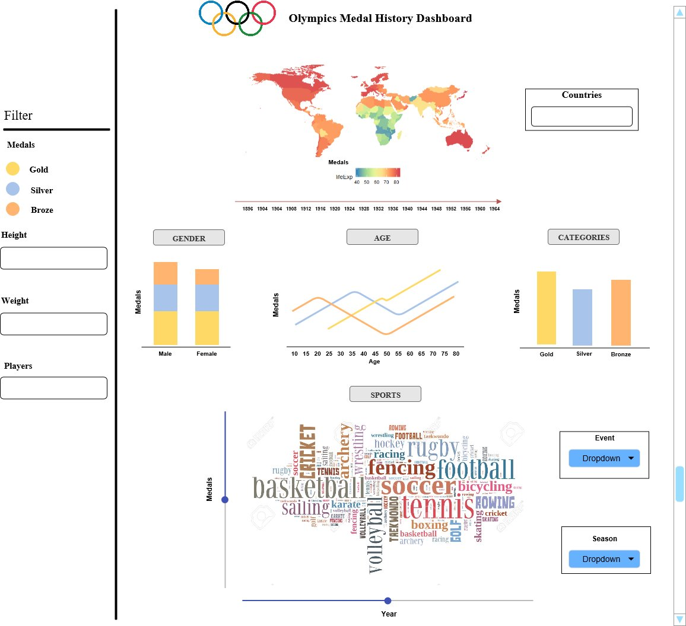

# Project Milestone 1: Proposal

UBC MDS DSCI 532  
January 2019   
Harjyot Kaur & Shayne Andrews

## Section 1: Overview

> The Canadian taxpayer is the single largest investor in Canada's Olympians and Paralympians to the tune of about $200-million spent annually on high-performance sport.  
> Own The Podium makes funding recommendations directing $70-million of it annually money – about $6-million of that comes from the Canadian Olympic Committee – to sports federations whose athletes demonstrate medal potential.  
> source: [The Globe and Mail](https://www.theglobeandmail.com/sports/olympics/canadas-newest-sports-minister-scouts-olympic-team-in-pyeongchang/article37889549/)

How do governments decide which sports to allocate their limited sporting budgets towards? There is great national pride in winning medals at the Olympics. The Minister of Sport (or equivalent) in every country is almost certainly confronted with the question of: __which Olympic events, if invested in appropriately, would be most likely to produce medalists for our country?__

We will build a dashboard that helps to answer this question using 120 years of historic Olympic results for all participating athletes.

## Section 2: Description of the data

The data we will use was compiled by Randi H Griffin and is [publicly available on Kaggle datasets](https://www.kaggle.com/heesoo37/120-years-of-olympic-history-athletes-and-results#athlete_events.csv).

This dataset contains approximately 271,000 results for unique combinations of athlete, event, and year.There are 134,732 unique athletes, 765 unique events (grouped into 66 sports like swimming, rowing, and figure skating), and 35 unique years (Summer Olympics since 1896, Winter Olympics since 1994).

We will display medal counts split by some of the athlete characteristics, such as Sex, Age, Height, and Weight. Perhaps the Minister of Sport may also want to filter the entire dashboard based on these characteristics.

## Section 3: Usage scenario & tasks

Canada's new Minister of Sport, Kirsty Duncan, wants to explore the country's historical performance at the Olympics in various events. She's new on the job, and so wants to brush up on the history so that she can make informed decisions about which sports to prioritize for funding (and which might be reduced).  

Kirsty is interested in understanding the characteristics of medal-winners (e.g. sex, age, height, weight) in various events, and how they might differ between Canada and other countries. She may notice certain other countries improving recently in specific events, and the dashboard may spark some further research to find out what actions those governments have taken to support their athletes.

Finally, Kirsty is interested in the "success rate" of the Canadian Olympic teams for each event over time. What proportion of participating athletes obtain a medal? Which ones are improving recently and which are not doing well? Combining answers to these questions with what Kirsty already knows about how funding is currently allocated will be extremely powerful for her to be successful as latest Canada's Sports Minister.

## Section 4: App Description & Sketch

The app contains a landing page that showcases the distribution of olympic medals across the world from 1896 - 2016. The app provides the flexibility to select multiple countries which would further be enlisted in the `Countries` widget provided. The timeline feature provided below the world map lends users the functionality to scroll through various years and select a time-period as required. Below the world map, there is a distribution of charts (depending on data type, bar chart and density chart) of dataset factors such as gender, age and medal count, all color coded in accordance with the medal category. Users can visualize the change in distribution of charts by selecting different countries, timelines or drop-down features provided on the right. Further, down the dashboard is a word cloud of sports that are a part of the olympic games. The size of the words in the word cloud are frequency dependent. The frequency of words is controlled by features selected by the users such as countries, time-period, drop-downs on the right and also by the `Medal` slider and `Year` slider. There are two word cloud dependent drop-downs available `Events` and `Season`. `Season` corresponds to selection of winter and summer and `Events` drop-down corresponds to selection of events played in a particular sport. On the extreme right of the dashboard, users can filter through different variables such as select a particular category of `Medals`, choose player `Height`, `Weight` and number of `Players`. Users can compare the distribution of medals across different variables by scrolling down through the app interface.

A sketch of the app is available below:

 
 

