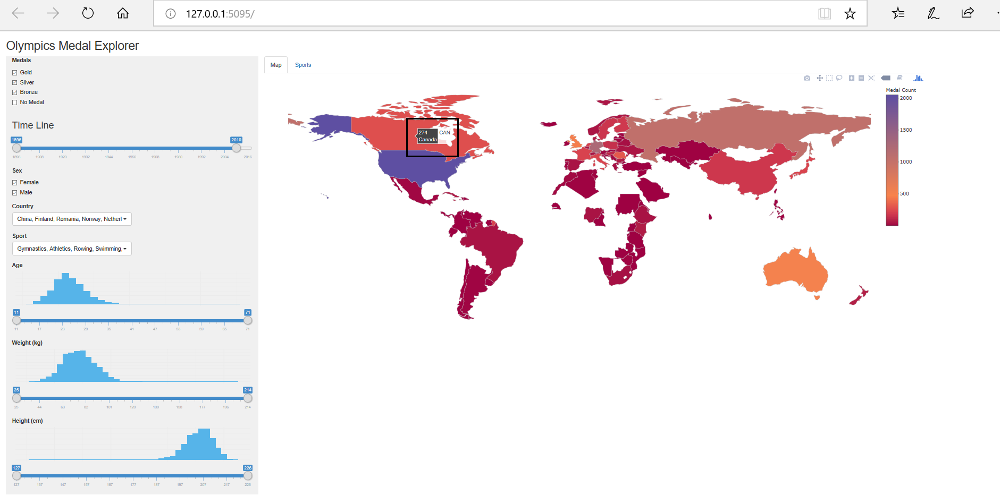
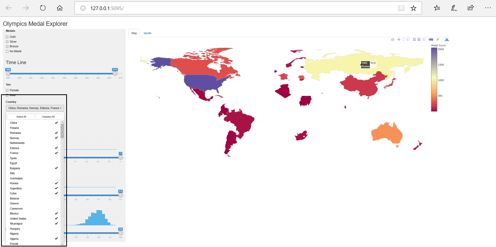
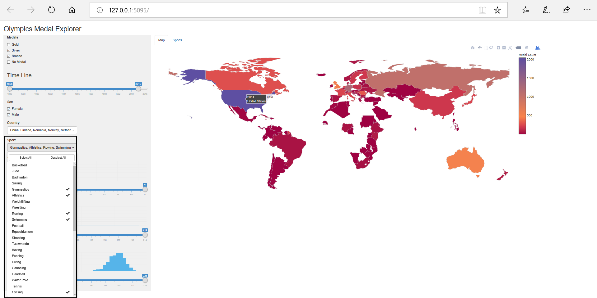
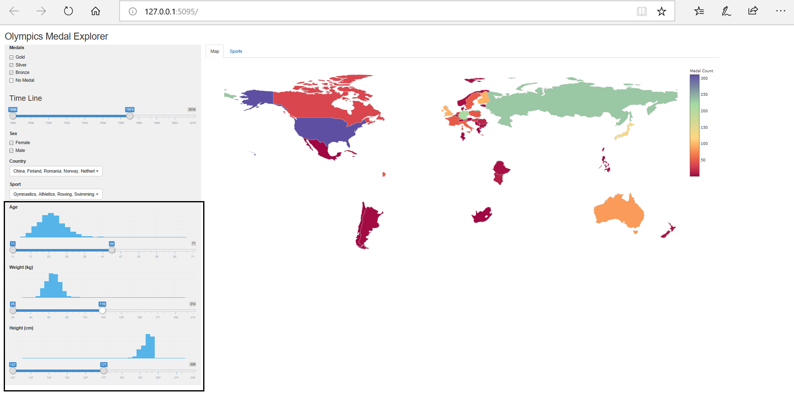
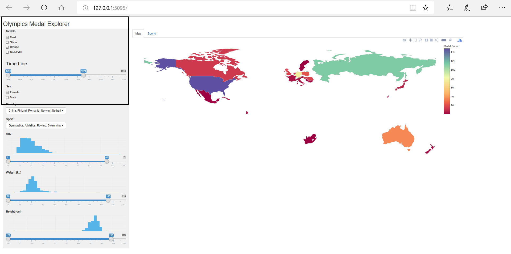
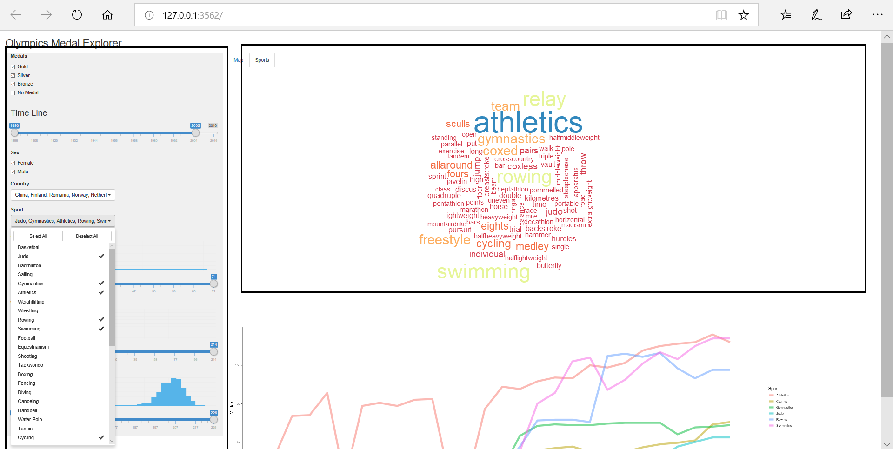
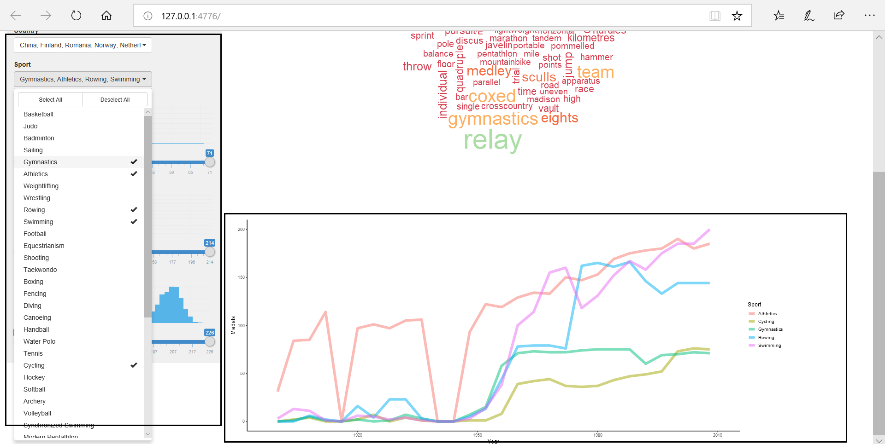

# Project Milestone 2: App Functionality and RoadMap Ahead

UBC MDS DSCI 532  
January 2019   
Harjyot Kaur & Shayne Andrews

## Rationale:

Our rationale to set-up this app is around the use case outlined below:   

The app is primarily designed for a person associated to any National Sports Authority seeking to make budget allocation decision for sports committees. The app would provide the user the flexibility to overview the medals won in a sport by their nation and the trend of medals won overtime . It provides a deep insight to the user in terms of player characteristics such as height, weight, age, sex. An example of the app usability, on the first tab `Map`, the user can view the number of `females` in `Canada`, who won a `gold medal`, in `swimming`, in the `time-period 1990-2000` satisfying a specific criterion for `height`, `weight` and `age`. Moving onto the second tab, `Sports`, the user can view a `Sports Word Cloud`, which showcases the frequency of players participating in `Swimming` related Olympic events from `Canada` and the medals they have won over a certain time period. The app would aid the user to make informed decisions by gauging the country's performance in different sports and thus allocating funds for sports committees accordingly.

We have implemented  the **hover effect** leveraging `plotly` in the world map. All the plots on the app are interactive and change in accordance with selection made on the sidebar panel. The histograms provided on the sidebar panel are also interactive and change with any selection made in the their slider or the dashboard. This would make the overall user experience more enjoyable and engaging.

## Tasks
The following are the tasks we had outlined for Milestone2:
- `Tab 1:`
  - Creating a world map for showing the count of medals for each country. Adding a hover effect so as to increase ease of viewing medals per country for the user.
  - Picking a library such that the it does not require addition of all possible latitudes and longitudes, as that would make the already large data set further large thus rendering the app to be slow.

- `Tab 2:`
  - Making a word cloud to showcase the frequency of players participating in different Olympic Sports.
  - Making a plot such that it encapsulates the trend of medals won in different sports over time.

- `Filters:`
  - Devising a set of features to support `Tab 1` and `Tab 2`. Also, try to include the distribution of those features.
  - Making histograms for features `Age`, `Weight`, and `Height`, along with their sliders.
  - Making a slider for `Time Line`.
  - Making check-boxes for `Sex` and `Medals`.
  - Making multiple selection possible for `Country` and `Sports` without cluttering the app interface.

## Tasks Implemented: App Screenshots and Functionality Overview

#### **Tab 1: World Map**

With the **hover effect** user has the flexibility to scroll over different countries and view the medal count.

The world map is interactive as the user can select one, many or deselect all countries. This provides the user to have a comparative analysis amongst different countries.

Further, the app also provides the user with the flexibility to select any number of sports to further delve deep into country-wise analysis of medals won in different sports.

The sliders provided for `Age`, `Weight` and `Height` provide the user added layers for comparisons as the histograms above these sliders interactively change when the user slides through the range provided for each of the categories. The world map will also change in accordance with the sliders so as to give user insight into medal winning player characteristics for various sports through different countries.

The user can also select checkboxes provided for `Medals` categories and `Sex`. This will give added filters to analyze the data.

 

#### **Tab 2: Sports**

This tab is specialized to support Olympic Sports oriented analytical tasks.

The `WordCloud` depicts the frequency of diverse sports events played across each category. For example, the sport `Swimming` has various categories such as backstroke, freestyle etc. The size of the word depicts the frequency of players playing those Sports in Olympics. The  `WordCloud` is also interactive and changes with any filter chosen from the side panel. The side panel is same for both the tabs. This, would provide user insight into what `Sports` in Olympics cater to highest participation given single/many countries.

On scrolling down the user can analyze the medals won for the selected sports through the years. The line-chart provided is also interactive and changes with any filter chosen on the side-panel.

## Future Milestones

- Reducing spacing around the world map and setting the tuning the zoom feature.
- Choose a better color scale for the heatmap
- Examining if a medal count bar chart can be added to the app without creating clutter.
- Reshaping the word cloud and making it more interactive in terms of adding a hover feature (will have to research its feasibility of implementation in R Shiny)
- Making a legend for WordCloud
- Making the legends better for the line chart

## Bugs

The app faces certain shortcomings in terms of slowness. The other major issue, that we are currently facing is with the wordcloud. If a fewer set of selections are done such as a single sport is added or country is chosen the word cloud is able to deliver the same with not much lag. Whereas, if a major change is made in the slider, especially the time line slider, the R-session suddenly aborts. Although, we face no such issue on shiny.apps.io.

Link to App: [Olympics Medal Exploration App](https://harjyotkaur.shinyapps.io/Olympics_app/)
